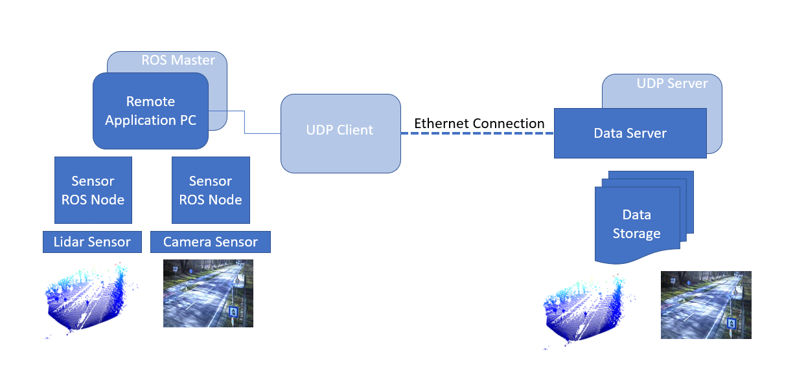

# Sensor Data Streamer from ROS master to Remote server
A ROS Node for streaming image topics and pointcloud from ROS with gStreamer and UDP sockets. At he receiving end you you can store the images and pointclouds synchronously. Using CV2 Bridge for ROS, we stream the image topics with CV2 gStreamer pipeline. We use UDP sockets to stream the received pointcloud. 

## For Camera Images
At sensor end, we subscribe to image topics. The ROS image topics are first converted to CV2 images using cv2_bridge. You can subscribe to raw image or compressed image. Configuration parameters can be edited in launch file. The CV2 image which is essentially a numpy array, is then compressed and sent over UDP socket to server.

At the receiver end, the received packets are saved with CV2 module.

## For Lidar Point Clouds
At Streamer end, we subscribe to "Pointcloud2" topic and data from the topic will be first converted to numpy array, pickeled it to serialize the data and compressed using bz2.  

At the receiveing end, the data will be received from UDP sockets and first unzip and depickled and then stored as compressed numpy array. With postprocessing, we can convert the npz array into .pcd file.

For every pointcloud received, we check the latest image frame from the redis server and write this image into the storage path. The time synchronization of different sensor data is enabled with message_filters ApproximateSync module.

The code primarily developed to record the sensor data in the R&D Project IN2Lab.

The saved .npz files can be converted to .pcd for visualization or storing in the post processing. A sample post processing script "converter.py" is provided. You can run the convertor.py only with Python3

**LAYOUT:**
- gStreamer_ROS/
  - launch/:              roslaunch files
  - src/:                 source files
  - script/:			Python scripts for the project
  - CMakeLists.txt:       CMake project configuration file
  - package.xml:          ROS/Catkin package file

**REQUIREMENTS:**

Refer [requirements.md]

**SETUP:**

Clone the repository into your catkin workspace and build with catkin_make

**LAUNCH:**

At Sensor End
source your catkin workspace and launch
roslaunch sensordata_streamer synchronized_stream.launch

At Server End
Either run the python scripts with python2 or
Launch with ROS launch using
roslaunch synchronized_receive.launch

**Improvements**

TCP Server can be used as server for reliable connection
Current code does not consider the loss of packet and might crash in such scenarios
